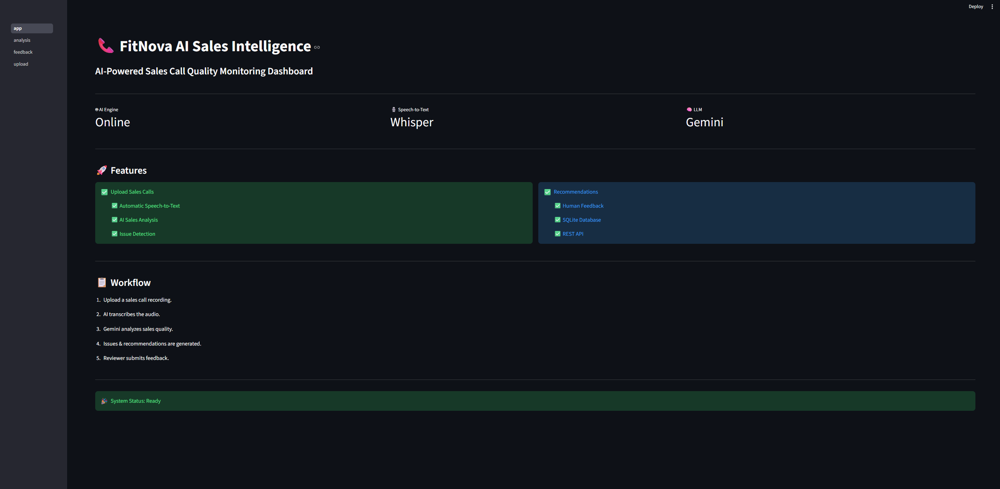
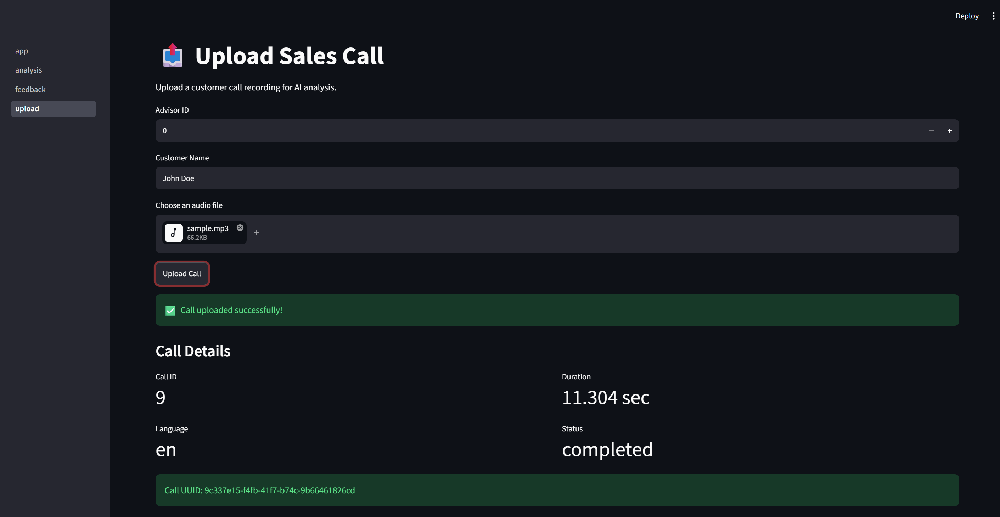
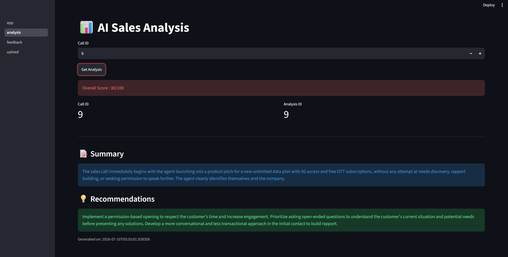
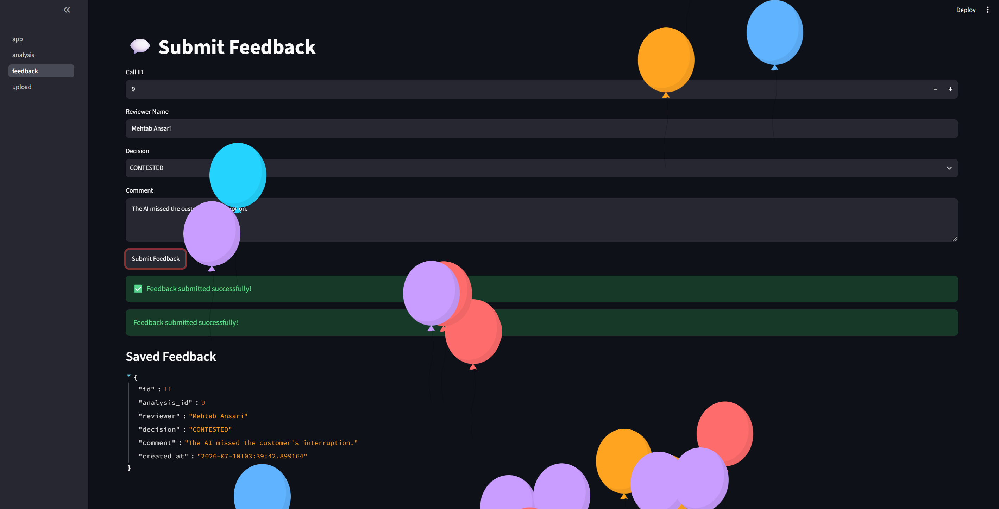
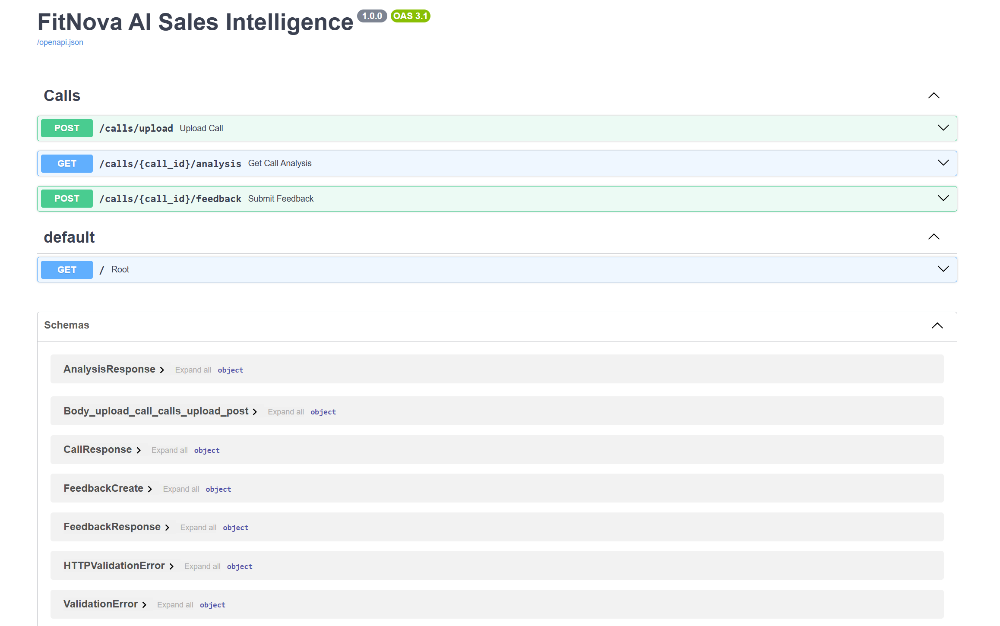
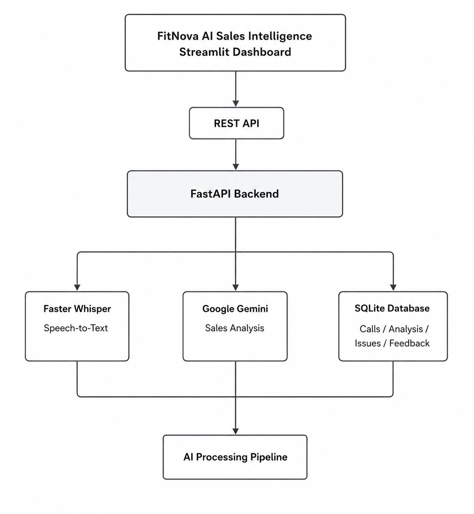
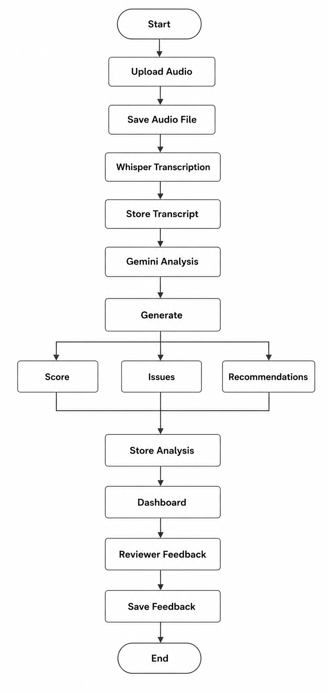

# FitNova AI Sales Intelligence

FitNova AI Sales Intelligence is an end-to-end AI-powered Sales Quality Monitoring System that automatically transcribes customer calls, evaluates advisor performance using Google Gemini, detects sales quality issues, generates actionable recommendations, and enables human reviewers to provide feedback on AI-generated evaluations.

---

## Dashboard

### Home



### Upload Sales Call



### AI Analysis



### Submit Feedback



### API Documentation



---

## System Architecture



---

## Workflow



---

# Features

- Upload customer sales call recordings
- Automatic speech-to-text transcription using Faster-Whisper
- AI-powered sales quality analysis using Google Gemini
- Automatic quality scoring
- Detection of sales quality issues
- AI-generated recommendations for improvement
- Human feedback and contest mechanism
- Persistent storage using SQLite and SQLAlchemy
- RESTful APIs built with FastAPI
- Interactive API documentation using Swagger UI
- Streamlit dashboard for demonstration

---

# Technology Stack

## Backend

- Python 3.12
- FastAPI
- SQLAlchemy
- Pydantic
- SQLite

## Artificial Intelligence

- Faster-Whisper
- Google Gemini API
- Prompt Engineering

## Frontend

- Streamlit

## Database

- SQLite

---

# Project Structure

```text
fitnova-ai-sales-intelligence/
│
├── app/
│   ├── ai/
│   │   ├── analyzer.py
│   │   ├── llm.py
│   │   ├── pipeline.py
│   │   ├── prompts.py
│   │   └── transcription.py
│   │
│   ├── database/
│   │   ├── connection.py
│   │   ├── crud.py
│   │   ├── enums.py
│   │   └── init_db.py
│   │
│   ├── models/
│   ├── routers/
│   ├── schemas/
│   ├── services/
│   └── main.py
│
├── dashboard/
│
├── docs/
│   ├── architecture.png
│   ├── workflow.png
│   ├── dashboard-home.png
│   ├── upload-page.png
│   ├── analysis-page.png
│   ├── feedback-page.png
│   └── swagger.png
│
├── tests/
├── uploads/
├── requirements.txt
├── README.md
└── .env.example
```

---

# System Workflow

1. Upload a customer call recording.
2. Store the uploaded audio file.
3. Create a call record in the database.
4. Transcribe the audio using Faster-Whisper.
5. Store transcript segments.
6. Analyze the transcript using Google Gemini.
7. Generate quality scores, detected issues, and recommendations.
8. Store analysis results in the database.
9. Allow advisors to review the analysis.
10. Collect human feedback for future improvements.

---

# AI Processing Pipeline

```text
Customer Call
      │
      ▼
Upload Audio
      │
      ▼
Save Audio File
      │
      ▼
Speech-to-Text
(Faster-Whisper)
      │
      ▼
Transcript Storage
      │
      ▼
LLM Analysis
(Google Gemini)
      │
      ├──────────────► Overall Score
      ├──────────────► Issues
      └──────────────► Recommendations
      │
      ▼
Database
      │
      ▼
Streamlit Dashboard
      │
      ▼
Human Feedback
```

---

# REST API Endpoints

| Method | Endpoint | Description |
|---------|----------|-------------|
| POST | `/calls/upload` | Upload a customer call and trigger the AI pipeline |
| GET | `/calls/{call_id}/analysis` | Retrieve AI-generated analysis |
| POST | `/calls/{call_id}/feedback` | Submit reviewer feedback |

Interactive API documentation is available at:

```
http://127.0.0.1:8000/docs
```

---

# Database Schema

The application uses the following entities:

- Organization
- Team
- Advisor
- Call
- TranscriptSegment
- Analysis
- Issue
- Feedback

---

# Sample Analysis Output

### Overall Score

```text
30 / 100
```

### Detected Issues

- No needs discovery
- Immediate product pitching
- Weak objection handling

### Recommendations

- Ask discovery questions before presenting a solution.
- Build rapport before introducing the product.
- Follow a customer-centric sales approach.
- Improve objection handling techniques.
- Use open-ended questions to better understand customer needs.

---

# Installation

Clone the repository.

```bash
git clone https://github.com/mehtab-ansari350/fitnova-ai-sales-intelligence.git
cd fitnova-ai-sales-intelligence
```

Create a virtual environment.

```bash
python -m venv venv
```

Activate the virtual environment.

Windows

```bash
venv\Scripts\activate
```

Install dependencies.

```bash
pip install -r requirements.txt
```

Create a `.env` file.

```env
DATABASE_URL=sqlite:///fitnova.db
GOOGLE_API_KEY=YOUR_GEMINI_API_KEY
```

Run the FastAPI server.

```bash
uvicorn app.main:app --reload
```

Run the Streamlit dashboard.

```bash
streamlit run dashboard/app.py
```

Open the API documentation.

```text
http://127.0.0.1:8000/docs
```

---

# Future Enhancements

- Speaker diarization
- Real-time call analysis
- Sentiment analysis
- Team performance dashboard
- Multi-language support
- Human feedback learning loop
- Retrieval-Augmented Generation (RAG) for coaching
- Role-based authentication and authorization
- Cloud deployment

---

# Author

**Mehtab Ansari**

AI Engineer | Machine Learning | Generative AI

**GitHub**

https://github.com/mehtab-ansari350

**LinkedIn**

https://www.linkedin.com/in/mehtab-ansari-ba4486266/